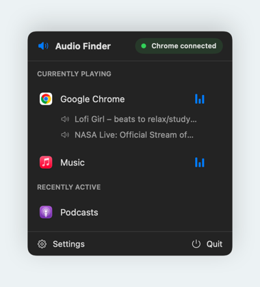
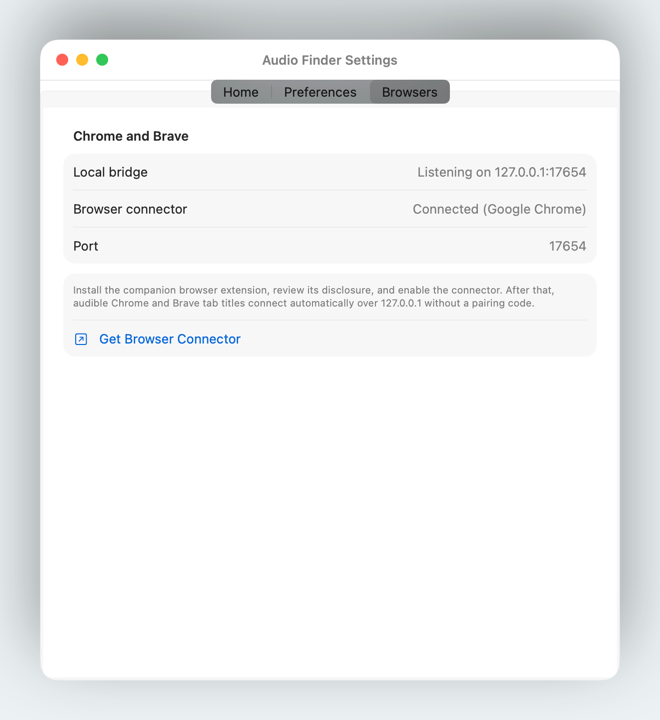
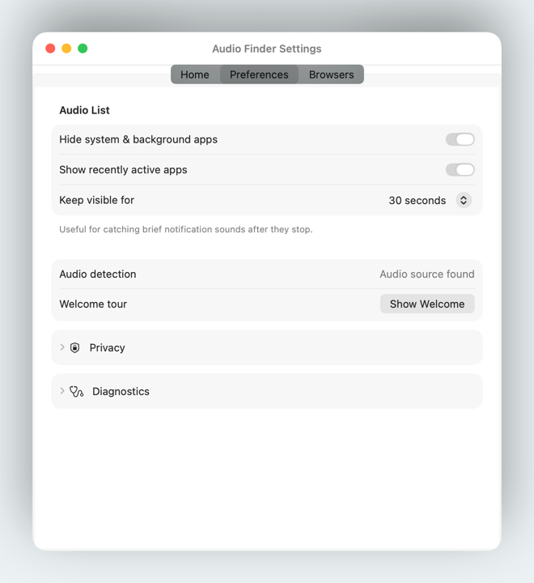

# Audio Finder

A macOS menu bar app that shows which apps are playing audio. Select an app to
bring it forward. The optional Chrome and Brave extension adds audible browser
tabs and lets you jump to the tab making sound.

Audio Finder reads audio activity through Core Audio. It does not record audio
or require microphone access. The browser connector runs only after you enable
it and communicates with the app locally on `127.0.0.1`.

## See it in action

**Find the app or tab making sound.** Open the menu bar popover to see what's
playing, then select an app or browser tab to jump to it. Recently active apps
stay visible briefly so you can track down short notification sounds too.



**Connect Chrome or Brave.** Enable the browser extension to see audible tab
titles in the menu. The Browsers settings show whether the local connector is
connected.



<details>
<summary>Preferences and privacy</summary>

Choose whether to hide background apps and how long to keep recently active
apps visible. Audio Finder reads audio activity without recording audio.



</details>

Screenshots show the app with example activity.

## Build and run the Mac app

You need macOS 14.2 or later and Xcode with a compatible macOS SDK.

```sh
git clone https://github.com/sparkyrider/Audio-Finder.git
cd Audio-Finder
./MacOS/scripts/install_local.sh
```

The script builds a Debug app with local ad hoc signing, installs it in
`~/Applications`, and opens it. No Apple Developer account is required. If an
older copy is installed there, the script moves it to the Trash first.
Set `AUDIO_FINDER_INSTALL_DIR` to choose a different installation folder.

Click Audio Finder's speaker icon in the menu bar to see current and recent
audio sources. Open **Settings** to configure launch at login and the browser
connector.

For development, open `MacOS/AudioFinder.xcodeproj` and run the `AudioFinder`
scheme, or build from the repository root:

```sh
xcodebuild -project MacOS/AudioFinder.xcodeproj -scheme AudioFinder \
  -configuration Debug -destination 'platform=macOS' \
  -derivedDataPath build/Local build CODE_SIGN_IDENTITY=- DEVELOPMENT_TEAM=
open build/Local/Build/Products/Debug/AudioFinder.app
```

## Run the browser extension

1. Keep the Debug Mac app running; Debug builds accept locally loaded extensions.
2. Open `chrome://extensions` or `brave://extensions` and enable **Developer mode**.
3. Choose **Load unpacked** and select this repository's `BrowserExtension` folder.
4. Open the extension's **Options**, read the disclosure, enable the connector,
   and choose **Save**. Choose **Brave** if automatic detection is incorrect.
5. Play audio in a normal browser tab, then choose **Test** in the extension's
   options. Open Audio Finder to see the audible tab and select it to jump there.

Incognito tabs are excluded. The connector uses local port `17654`, with
`17655` as a fallback. It sends audible tab titles, tab/window identifiers, and
mute state; it does not send URLs, browsing history, page contents beyond the
tab title, or audio. Disable it by clearing the checkbox and choosing **Save**.

## Tests

Run from the repository root. Extension tests require Node.js 22 or later.

```sh
xcodebuild -project MacOS/AudioFinder.xcodeproj -scheme AudioFinder \
  -destination 'platform=macOS' -derivedDataPath build/Tests \
  test CODE_SIGN_IDENTITY=- DEVELOPMENT_TEAM=
node --test BrowserExtension/Tests/*.mjs
```

App source and tests live in `MacOS/`; extension source and tests live in
`BrowserExtension/`. Build and test checks run on pull requests.
Report security issues through [private vulnerability reporting](https://github.com/sparkyrider/Audio-Finder/security/advisories/new).

## License

[MIT](LICENSE). You may use, modify, and redistribute the original code and
artwork, including commercially, while retaining the copyright and license
notices. See [NOTICE](NOTICE) for third-party browser marks and attribution.
